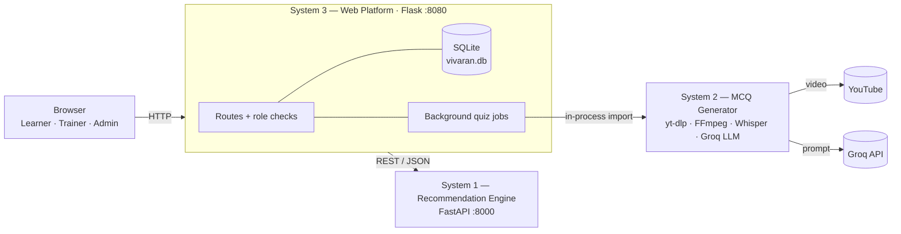

# Vivaran-VQE

**Vivaran Validation, Questionnaire & Evaluation Portal**: an AI-enabled platform for building competencies in India's Official Statistical System.

> Smart India Hackathon 2026 · Problem Statement **SIH26101** · **Team EdTech**


---

## Table of contents

- [The problem](#the-problem)
- [What Vivaran-VQE does](#what-vivaran-vqe-does)
- [Features by role](#features-by-role)
- [Architecture](#architecture)
- [Tech stack](#tech-stack)
- [Repository structure](#repository-structure)
- [Getting started](#getting-started)
- [Configuration](#configuration)
- [Running the tests](#running-the-tests)
- [Documentation](#documentation)
- [Security notes](#security-notes)
- [Roadmap](#roadmap)
- [Team](#team)

---

## The problem

**SIH26101** asks for an AI-enabled learning platform with three parts:

- It identifies **competency gaps** in officials of the Official Statistical System.
- It recommends **personalised training** from the iGOT Karmayogi ecosystem.
- It **generates quizzes and MCQs from learning material**, so officials can check what they actually learned.

Today, officials are often assigned training by designation alone. Nobody checks whether a course closed the gap it was meant to close.

## What Vivaran-VQE does

Vivaran-VQE closes the loop **Assess → Recommend → Learn → Verify → Re-assess**:

1. **Assess.** An official registers with a `@gov.in` email, their designation and their area of experience, then rates their current skills.
2. **Recommend.** The recommendation engine compares those skills with what the role requires. It builds a **roadmap of 3–6 courses** ordered by level.
3. **Learn.** The official watches the course video on the course page.
4. **Verify.** The MCQ engine downloads the course video, transcribes it with Whisper and uses an LLM to write **multiple-choice questions grounded in the transcript**. The official takes the quiz.
5. **Re-assess.** Quiz results become **verified skill levels**. The gap analysis and roadmap update automatically. Missed questions become **flashcards**.

A trainer is assigned to each learner automatically and can shape their path. Admins oversee the whole platform.

---

## Features by role

### 👩‍💼 Learner (government official)
- Registration restricted to **`@gov.in`**, with designation, area of experience and self-rated skills
- **Dynamic roadmap** of 3–6 courses that refreshes as skills are verified
- **Skill-gap view**: required level vs. current level, where current is quiz-verified, else self-rated
- **Course catalogue** with a skill filter, search, two courses per row and infinite scroll
- Course page with the embedded video, progress tracking and **AI-generated quiz** (pass mark 60%)
- Detailed **results** with attempt history and answer review
- **Flashcards** built from quiz questions, which unlock after the first quiz and track mastery
- **My progress**: daily streaks (IST), XP, 7 levels and 9 badges
- Collapsible sidebar layout shared with the trainer and admin workspaces

### 🧑‍🏫 Trainer
- Registration with **multiple skill specialisations**
- Automatic learner assignment: best skill match, then lightest load. A new trainer receives a batch of 5.
- **Student view**: each learner's roadmap, gaps and quiz performance. Trainers can **add or remove courses** in a learner's path.
- **Course uploads** (YouTube links) that go through **peer approval**: another trainer who shares at least one skill reviews them, and the admin reviews them when no such trainer exists. Rejected uploads can be edited and resubmitted.
- **Verify MCQs**: review, edit or discard AI-generated questions for courses **the trainer uploaded**
- Dashboard with charts: learners, uploads, approvals and quiz outcomes

### 🛡️ Admin
- Platform **overview** with KPIs and charts
- Management of learners and trainers: reassign, **auto-balance** load (⌈N/T⌉ per trainer), assign unassigned learners
- Account actions: activate or deactivate accounts, **reset passwords** (temporary password, change forced at next login)
- **Approval queue** for courses no trainer can review, plus **admin override** on any decision
- **Skill-gap analytics** across the organisation
- Course control: publish or unpublish, reload the catalogue, review **quality flags** on questions
- **CSV reports** and a full **audit log**
- **Up to 2 additional admins** by email. Only the primary admin can manage them, and there are at most 3 admins.

---

## Architecture

Vivaran-VQE is made of **three cooperating systems**:



| System | Role | How System 3 reaches it |
|---|---|---|
| **System 1: Recommendation Engine** | Competency profiles, skill-gap computation, course recommendations | HTTP to `127.0.0.1:8000` (`s1_client.py`). System 3 **falls back to local gap logic** if it is down. |
| **System 2: MCQ Generator** | Video → audio → Whisper transcript → LLM-written, fact-checked MCQs | Imported in-process (`s2_bridge.py`) and run in a background thread. The browser polls the job status. |
| **System 3: Web Platform** | Accounts, dashboards, roadmap, courses, quizzes, flashcards, trainer and admin workspaces | The app the user opens |

**Quiz caching.** Generated MCQ sets are stored per course and video in `quiz_bank`. The slow pipeline (download, transcription, LLM) therefore runs **once per video**, not once per learner.

A full technical walkthrough with sequence diagrams and data flows is in [`TECHNICAL_DOCUMENTATION.md`](System-3%20Complete_Website/TECHNICAL_DOCUMENTATION.md).

---

## Tech stack

| Layer | Technology |
|---|---|
| Web platform | Python, **Flask 3**, Jinja2 server-rendered templates |
| Front end | Hand-written CSS design system (iGOT-style orange theme), vanilla JavaScript, pure-CSS charts |
| Recommendation engine | **FastAPI**, Uvicorn, Pydantic v2, pandas |
| MCQ generation | **yt-dlp**, **FFmpeg**, **OpenAI Whisper** (local), PyTorch, **Groq LLM** via LangChain |
| Storage | **SQLite** with additive, idempotent migrations |
| Security | Werkzeug password hashing, role-based route guards, audit log |

---

## Repository structure

```
.
├── README.md
├── System-1 Recommandation_Engine/   # FastAPI recommendation engine
│   ├── app/                          #   API (app/main.py)
│   ├── datasets/                     #   skills, roles, courses datasets
│   ├── context/                      #   design notes
│   └── tests/
├── System-2 MCQ_Generator/           # Video → transcript → MCQ pipeline
│   ├── app.py
│   ├── utils/
│   ├── prompts/mcq_prompt.txt
│   ├── requirements.txt
│   └── .env                          #   GROQ_API_KEY (NOT committed)
└── System-3 Complete_Website/        # Flask web platform
    ├── run_vivaran.py                #   one-command launcher (System 1 + System 3)
    ├── app.py                        #   all routes
    ├── db.py                         #   SQLite schema + migrations
    ├── courses.py                    #   catalogue loader
    ├── recommender.py                #   roadmap builder
    ├── progress.py                   #   streaks, XP, levels, badges
    ├── s1_client.py / s2_bridge.py   #   connectors to System 1 / System 2
    ├── settings.py / envcompat.py    #   configuration
    ├── create_user.py                #   create admin / trainer accounts
    ├── pregenerate_quizzes.py        #   warm the MCQ cache
    ├── templates/  static/           #   UI
    ├── test_*.py                     #   test suites
    └── *.md                          #   project docs
```

---

## Getting started

### Prerequisites

- **Python 3.10+** (developed on 3.14)
- **FFmpeg** on your `PATH`. On macOS: `brew install ffmpeg`. On Windows: download it and set `VIVARAN_FFMPEG_DIR`.
- A **Groq API key** from [console.groq.com](https://console.groq.com), needed for real quiz generation only

### 1. Clone and create a virtual environment

```bash
git clone <your-repo-url> vivaran-vqe
cd vivaran-vqe

python3 -m venv venv
source venv/bin/activate          # Windows: venv\Scripts\activate
```

### 2. Install dependencies

```bash
pip install fastapi uvicorn pandas pydantic flask python-dotenv werkzeug
pip install -r "System-2 MCQ_Generator/requirements.txt"
```

> Whisper and PyTorch are large downloads. Budget a few minutes the first time.

### 3. Add your Groq key

Create `System-2 MCQ_Generator/.env`:

```env
GROQ_API_KEY=your_groq_key_here
WHISPER_MODEL=base
```

### 4. Run the platform

```bash
cd "System-3 Complete_Website"
export VIVARAN_S1_PYTHON="$(which python)"     # run System 1 with this same venv
export VIVARAN_ADMIN_USER=admin                 # seeds the primary admin on first run
export VIVARAN_ADMIN_PASSWORD='choose-a-strong-password'
python run_vivaran.py
```

This starts **System 1 on :8000** and **System 3 on :8080**. Open **http://127.0.0.1:8080**. Press `Ctrl+C` to stop both.

<details>
<summary>Windows (PowerShell)</summary>

```powershell
cd "System-3 Complete_Website"
$env:VIVARAN_S1_PYTHON = (Get-Command python).Source
$env:VIVARAN_ADMIN_USER = "admin"
$env:VIVARAN_ADMIN_PASSWORD = "choose-a-strong-password"
python run_vivaran.py
```
</details>

### 5. Create accounts

- **Learners and trainers** register on the website with a `@gov.in` email.
- **Admins** are seeded from the environment variables above. You can also create one from the command line, which prompts for the password:

  ```bash
  python create_user.py --role admin --username admin1
  python create_user.py --role trainer --username trainer1 --email trainer1@gov.in
  ```

### Demo mode (no GPU, no API key)

To demo the whole flow without downloading videos or calling the LLM:

```bash
export VIVARAN_FAKE_QUIZ=1
python run_vivaran.py
```

Quizzes are then filled with placeholder questions. Demo sets are kept apart and **never shown in real runs**.

To warm the real MCQ cache before a presentation, so learners don't wait for transcription:

```bash
python pregenerate_quizzes.py
```

---

## Configuration

All settings are optional environment variables. **No secrets are hard-coded.**

| Variable | Default | Purpose |
|---|---|---|
| `VIVARAN_PORT` | `8080` | Web platform port |
| `VIVARAN_SECRET` | random per run | Flask session secret. **Set this in production** or sessions reset on restart. |
| `VIVARAN_DB` | `vivaran.db` | SQLite database path |
| `VIVARAN_S1_URL` | `http://127.0.0.1:8000` | Recommendation engine URL |
| `VIVARAN_S1_PYTHON` | `python` on PATH | Interpreter used to launch System 1 |
| `VIVARAN_S2_ROOT` | `../System-2 MCQ_Generator` | Location of the MCQ generator |
| `VIVARAN_FFMPEG_DIR` | none | Folder containing `ffmpeg` if it is not on PATH |
| `VIVARAN_COURSES` | `data/courses.*` | Official course document (CSV / XLSX / JSON) |
| `VIVARAN_EMAIL_DOMAIN` | `gov.in` | Allowed registration email domain |
| `VIVARAN_PASS_THRESHOLD` | `60` | Quiz pass mark (%) |
| `VIVARAN_QUIZ_QUESTIONS` | `5` | Questions per quiz |
| `VIVARAN_ROADMAP_MIN` / `_MAX` | `3` / `6` | Roadmap size |
| `VIVARAN_TRAINER_BATCH` | `5` | Learners given to a newly registered trainer |
| `VIVARAN_TZ` | `Asia/Kolkata` | Time zone for streak days |
| `VIVARAN_ADMIN_USER` / `_PASSWORD` | none | Seed the primary admin on first start |
| `VIVARAN_TRAINER_USER` / `_PASSWORD` | none | Seed a trainer on first start |
| `VIVARAN_FAKE_QUIZ` | off | `1` = demo questions instead of the real pipeline |
| `GROQ_API_KEY` | none | Groq LLM key (in `System-2 MCQ_Generator/.env`) |
| `WHISPER_MODEL` | `base` | Whisper model size (`tiny`, `base`, `small`, …) |

> Older `ANTAHAI_*` variable names still work: `envcompat.py` maps them to `VIVARAN_*`.

---

## Running the tests

The test suites run fully offline in demo mode:

```bash
cd "System-3 Complete_Website"
export VIVARAN_FAKE_QUIZ=1
python test_learner_flow.py      # 79 checks
python test_trainer_flow.py      # 83 checks
python test_admin_flow.py        # 66 checks
python test_progress.py          # 26 checks
```

That is **254 checks** covering registration, roadmap generation, quizzes, flashcards, trainer assignment, peer approval, admin controls, role-based access and progress/XP.

---

## Documentation

| Document | What's inside |
|---|---|
| [`PROJECT_OVERVIEW.md`](System-3%20Complete_Website/PROJECT_OVERVIEW.md) | Plain-language overview of what the platform does and how |
| [`TECHNICAL_DOCUMENTATION.md`](System-3%20Complete_Website/TECHNICAL_DOCUMENTATION.md) | Tech stack rationale, architecture, user flows, workflows, feasibility and scalability |
| [`CHANGES.md`](System-3%20Complete_Website/CHANGES.md) | Changelog of every feature update |

---

## Security notes

- Passwords are stored **only as salted hashes** and never returned to the front end.
- Every route is protected by **role checks**, so learners, trainers and admins see only their own workspace.
- Admin actions are recorded in an **audit log**.
- Secrets live in **environment variables or `.env`**, never in code.

**Never commit** `.env`, `*.db`, `venv/`, or `uploads/`. Keep them in `.gitignore`. If a key was ever pushed, **rotate it** at the provider.

---

## Roadmap

The prototype is intentionally lightweight. The planned path to production is:

- **PostgreSQL** in place of SQLite
- **Gunicorn + Nginx** in place of the Flask dev server
- **Redis + RQ/Celery** in place of in-process quiz threads
- **faster-whisper on GPU** for faster transcription
- **Docker** images deployable on **MeghRaj (GI Cloud)**
- A **self-hosted LLM**, so no course content leaves government infrastructure
- Integration with the live **iGOT Karmayogi** course API and SSO

Details and estimates are in [`TECHNICAL_DOCUMENTATION.md`](System-3%20Complete_Website/TECHNICAL_DOCUMENTATION.md).

---

## Team

**Team EdTech**, Smart India Hackathon 2026

| Name |
|---|---|
| _Priyanshi Tamta_|
| _Vanshika Maheshwari_ |
| _Harshita Agrawal_ |
| _Ridhima Sharma_|
| _Parth Raj Jaiswal_ |
| _Atharv Kamboj_ |


---

<sub>Built for Smart India Hackathon 2026 · Problem Statement SIH26101: capacity building in India's Official Statistical System.</sub>